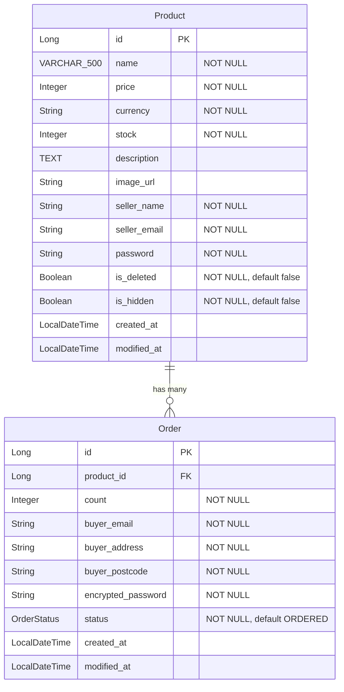

# Sparta Pre-Ecommerce

상품(Product)과 주문(Order) 두 도메인으로 구성된 주문 관리 서비스입니다.

## Tech Stack

- Java 21
- Spring Boot 4.0.2
- Spring Security (BCrypt 비밀번호 암호화)
- Spring Data JPA / Hibernate
- PostgreSQL
- SpringDoc OpenAPI 3.0.1 (Swagger UI)
- Lombok

## Getting Started

### 1. 데이터베이스 생성

```bash
createdb -U postgres ecommerce
```

### 2. 애플리케이션 실행

```bash
./gradlew bootRun
```

### 3. API 문서 확인

- Swagger UI: `http://localhost:8080/api/swagger-ui/index.html`
- OpenAPI JSON: `http://localhost:8080/api/v3/api-docs`

## ERD



## Q&A

### Q1. 상품 삭제는 실제 DB 삭제인가요? 숨김 처리인가요? 그 이유는?

`isDeleted` 변수를 두어 소프트 삭제로 처리하였습니다.
비즈니스적으로 유저의 사용량 트래킹을 위해 필요한 정보일 수 있고, 설령 해당 정보가 불필요하더라도 CS적으로 실수로 지웠다는 문의가 들어왔을 때 복구할 수 있도록 TTL을 걸어 3개월 이후에 실 데이터를 정리하는 것이 이상적이라고 생각해서입니다.

### Q2. 현재 구조에서의 문제점과 개선 방법은?

첫번째 문제는 유저 엔티티가 없어 유저별 정보 취합이 어려운 형태입니다.
인증 체계 부재를 전제로 해서 유저 정보가 주문과 프로덕트에 각각 분산되어 들어가 있어 유저 정보의 분리가 시급합니다.

다만 유저 정보에는 민감 정보가 포함될 수 있으므로 보안 및 인증 체계를 구현해야 하는데, 미니 프로젝트인 만큼 해당 기능 구현을 하지 않았기에 유저 엔티티를 따로 만들지 않았습니다.
만약 당장 개선한다면 회원가입 및 로그인 기능이 가장 먼저 필수적으로 들어가 판매자는 무조건 회원만이 올릴 수 있도록 처리하면 비교적 안정적으로 진행할 수 있을 것 같습니다.
관련 상품 수정·삭제를 위한 권한 체크 API에 이미 관련 주석을 남겨둔 부분이 있습니다.

### Q3. 가장 단순하게 구현한 부분은? 시간이 더 있었다면?

시간이 더 있었으면 유저 기능(회원가입, 로그인)을 개발했을 것이고, 페이지네이션 방법들을 좀 더 고민했을 것 같습니다.

### Q4. 트래픽이 몰리면 어떤 문제가 발생할 수 있나요?

커넥션 고갈로 DB와 연결이 멈출 수 있습니다. 이 경우 서버를 아예 껐다 켜야 했던 기억이 있습니다.
쿼리를 비롯한 커넥션 관리를 잘해야 하는 것은 아는데, 이건 트랜잭션과 관련이 있어서 조금 어려웠던 것 같습니다.
불필요한 트랜잭션을 줄이고 오랜 시간이 쓰이는 경우 트랜잭션을 필요한 부분에서만 어노테이션 대신 트랜잭션 매니저를 사용해서 수동으로 걸어 해결했었습니다.

트래픽이 몰리면 서버 부하도 있을 수 있는데, 관련해서는 오토스케일링 등으로 분산 처리를 해줘야 합니다.

## API Endpoints

### Product API

| Method | Endpoint                          | Description                |
|--------|-----------------------------------|----------------------------|
| GET    | `/api/products`                   | 상품 목록 조회 (페이지네이션)  |
| POST   | `/api/products`                   | 상품 등록                    |
| GET    | `/api/products/{id}`              | 상품 상세 조회                |
| PUT    | `/api/products/{id}`              | 상품 수정 (판매자 인증 필요)   |
| DELETE | `/api/products/{id}`              | 상품 삭제 (판매자 인증 필요)   |
| GET    | `/api/products/{id}/authorization` | 판매자 권한 확인              |
| GET    | `/api/products/sellers`           | 판매자별 상품 목록 조회        |
| GET    | `/api/products/search`            | 상품 검색                    |

### Order API

| Method | Endpoint                              | Description                          |
|--------|---------------------------------------|--------------------------------------|
| POST   | `/api/products/{productId}/orders`    | 상품 주문                             |
| GET    | `/api/products/{productId}/orders`    | 상품별 주문 내역 조회 (판매자 인증 필요) |
| GET    | `/api/orders`                         | 구매자 이메일로 주문 내역 조회          |
| GET    | `/api/orders/{orderId}`               | 주문 단건 조회 (주문 비밀번호 필요)     |

## Project Structure

```
com.sparta.ecommerce
├── _global
│   ├── component        # AnsiColorCode, GlobalValues
│   ├── config           # Security, WebMvc, Jackson, RestTemplate
│   ├── enums            # OrderStatus
│   ├── exception        # BusinessException, ExceptionCode, Handler
│   └── utility          # Timestamped, EncoderUtils, Utility
├── product
│   ├── controller       # ProductController
│   ├── dto              # ProductDto (Info, DetailInfo, Request, SellerAuth)
│   ├── entity           # Product
│   ├── repository       # ProductRepository
│   └── service          # ProductService, ProductServiceImpl
└── order
    └── entity           # Order
```

## Daily Log

### 2026-01-27
- 프로젝트 초기 세팅 (Spring Boot 4.0.2, PostgreSQL, Spring Security)
- Product 엔티티 및 CRUD API 구현 (등록, 조회, 수정, 삭제, 검색)
- Order 엔티티 설계 (Product와 ManyToOne 관계)
- 판매자 비밀번호 BCrypt 암호화 (EncoderUtils 유틸리티)
- 주문이 존재하는 상품의 가격 변경 방지 로직
- 글로벌 예외 처리 구조 구축 (BusinessException, ExceptionCode)
- Swagger (SpringDoc OpenAPI 3.0.1) 연동
- ERD 작성

### 2026-01-28
- Product 도메인 기능 보강 (소프트 삭제, 판매자별 상품 조회, 권한 확인 API)
- 재고 원자적 차감 구현 (DB 쿼리 방식 UPDATE ... WHERE stock >= count)
- Order CRUD API 구현 (주문 생성, 단건 조회, 목록 조회)
- JOIN FETCH로 N+1 문제 해결
- 주문 비밀번호 암호화 저장
- OrderStatus enum 기반 주문 상태 관리
- 테이블명 orders로 변경 (SQL 예약어 충돌 방지)
- ERD 및 README 현재 엔티티에 맞게 업데이트