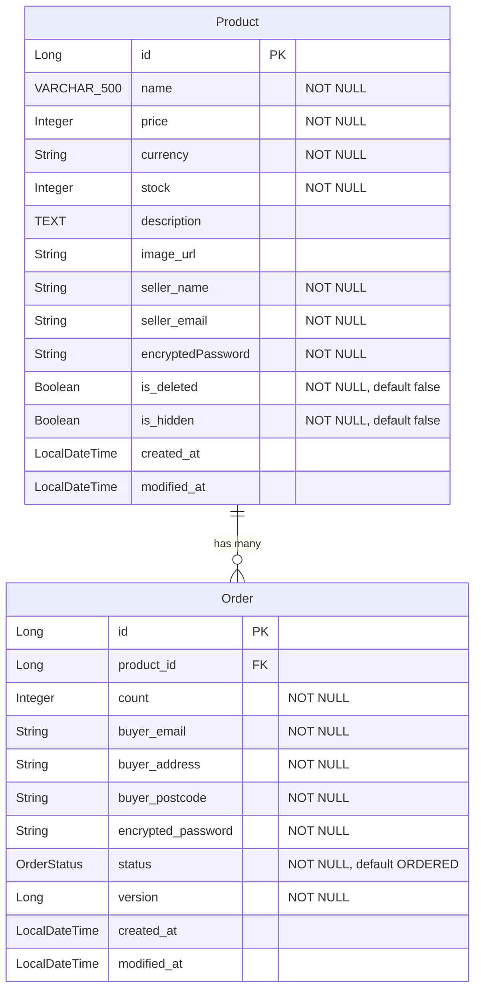
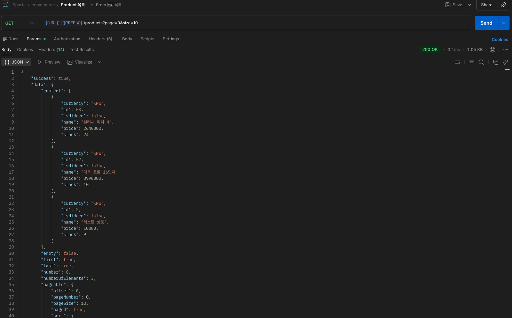
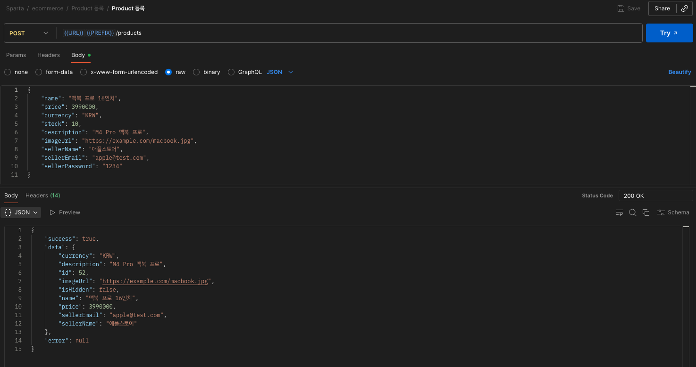
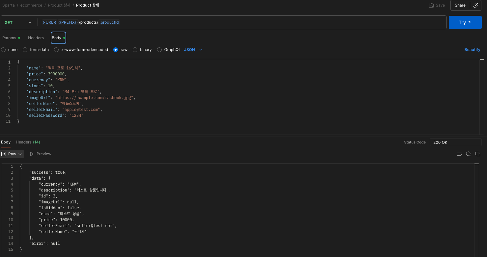
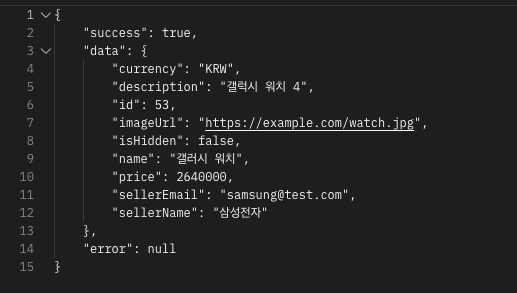
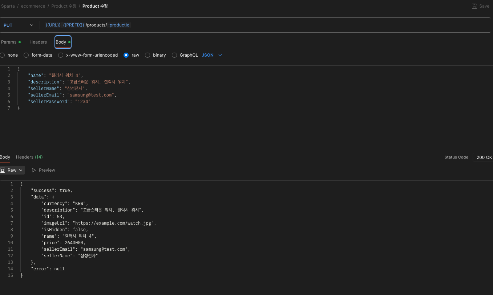
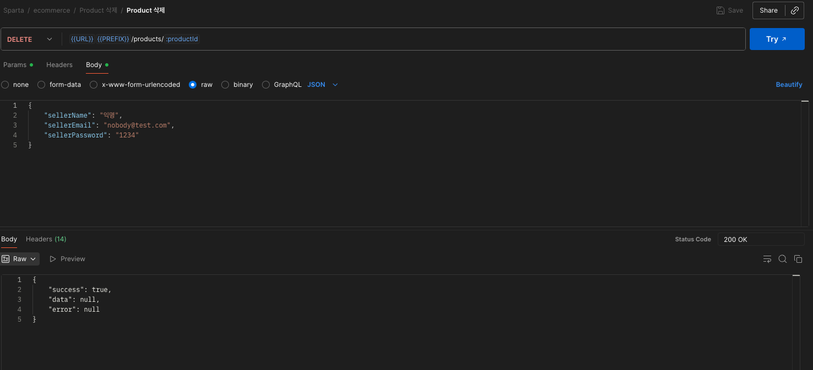
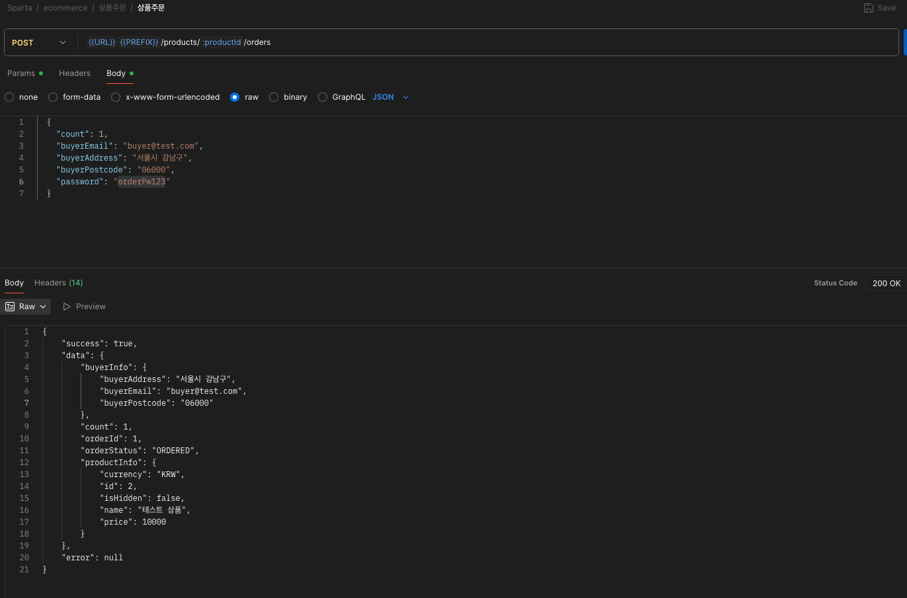
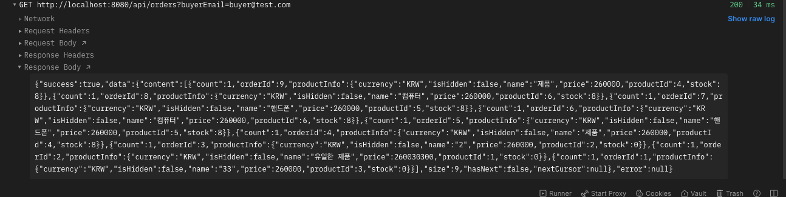
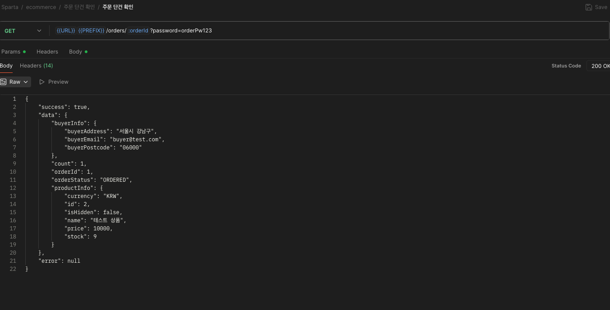

# Sparta Pre-Ecommerce

상품(Product)과 주문(Order) 두 도메인으로 구성된 주문 관리 서비스입니다.

## Tech Stack

- Java 21
- Spring Boot 4.0.2
- Spring Security (BCrypt 비밀번호 암호화)
- Spring Data JPA / Hibernate
- PostgreSQL
- SpringDoc OpenAPI 3.0.1 (Swagger UI)
- Lombok

## Getting Started

### 1. 데이터베이스 생성

```bash
createdb -U postgres ecommerce
```

### 2. 애플리케이션 실행

```bash
./gradlew bootRun
```

### 3. API 문서 확인

- Swagger UI: `http://localhost:8080/api/swagger-ui/index.html`
- OpenAPI JSON: `http://localhost:8080/api/v3/api-docs`

## ERD



## Q&A

### Q1. 상품 삭제는 실제 DB 삭제인가요? 숨김 처리인가요? 그 이유는?

`isDeleted` 변수를 두어 소프트 삭제로 처리하였습니다.
일단 현재 구조상 주문에 상품엔티티가 걸려잇기 때문에 판매자가 삭제를 하였다고 해도 주문자의 주문 내역에는 상품 정보가 필요합니다. 
그렇기에 실 데이터를 지우는 것은 주의 하여야합니다. 
혹여나 주문 내역에 상품 정보를 아예 다 지우거나 혹은 상품 정보를 따로 들고 있는 다고 해도, 비즈니스적으로 유저의 사용량 트래킹을 위해 필요한 정보일 수 있고, 
설령 해당 정보가 불필요하더라도 CS적으로 실수로 지웠다는 문의가 들어왔을 때 복구할 수 있도록 TTL을 걸어 3개월 이후에 실 데이터를 정리하는 것이 이상적이라고 생각해서입니다.

### Q2. 현재 구조에서의 문제점과 개선 방법은?

첫번째 문제는 유저 엔티티가 없어 유저별 정보 취합이 어려운 형태입니다.
인증 체계 부재를 전제로 해서 유저 정보가 주문과 프로덕트에 각각 분산되어 들어가 있어 유저 정보의 분리가 시급합니다.

다만 유저 정보에는 민감 정보가 포함될 수 있으므로 보안 및 인증 체계를 구현해야 하는데, 미니 프로젝트인 만큼 해당 기능 구현을 하지 않았기에 유저 엔티티를 따로 만들지 않았습니다.
만약 당장 개선한다면 회원가입 및 로그인 기능이 가장 먼저 필수적으로 들어가 판매자는 무조건 회원만이 올릴 수 있도록 처리하면 비교적 안정적으로 진행할 수 있을 것 같습니다.
관련 상품 수정·삭제를 위한 권한 체크 API에 이미 관련 주석을 남겨둔 부분이 있습니다.

### Q3. 가장 단순하게 구현한 부분은? 시간이 더 있었다면?

시간이 더 있었으면 유저 기능(회원가입, 로그인)을 개발했을 것이고, 페이지네이션 방법들을 좀 더 고민했을 것 같습니다.

### Q4. 트래픽이 몰리면 어떤 문제가 발생할 수 있나요?

커넥션 고갈로 DB와 연결이 멈출 수 있습니다. 이 경우 서버를 아예 껐다 켜야 했던 기억이 있습니다.
쿼리를 비롯한 커넥션 관리를 잘해야 하는 것은 아는데, 이건 트랜잭션과 관련이 있어서 조금 어려웠던 것 같습니다.
불필요한 트랜잭션을 줄이고 오랜 시간이 쓰이는 경우 트랜잭션을 필요한 부분에서만 어노테이션 대신 트랜잭션 매니저를 사용해서 수동으로 걸어 해결했었습니다.

트래픽이 몰리면 서버 부하도 있을 수 있는데, 관련해서는 오토스케일링 등으로 분산 처리를 해줘야 합니다.

## 도전 과제

### 주문 목록 조회 (N+1 문제 해결)

주문 목록 조회 시 Order → Product에 접근하면 N+1 문제가 발생할 수 있다.

주문에는 상품이 관계로 걸려 있고, 주문의 응답값에는 상품 관련 값들도 함께 반환되어야 한다.
이때 JPA의 `order.getProduct()`를 사용하면 지연 로딩(LAZY) 때문에 쿼리가 주문 개수만큼 추가로 발생하게 된다.

데이터를 연결해두면 한번 리포지토리에서 값을 불러올 때 연관된 항목을 모두 엮어 올리면 오랜 시간이 걸리기 때문에, LAZY를 걸어 필요한 엔티티만 가져와 성능을 향상시킨다.
하지만 관계가 있다는 것은 어디선가 하나의 엔티티에 연관된 값들까지 같이 필요할 수 있다는 뜻이다.
실제로 리포지토리에서 받아오지 못한 연관 엔티티는 HibernateProxy로만 존재하다가, `order.getProduct()`를 호출할 때 프록시 초기화가 되면서 실제 쿼리가 날아가게 된다.

이때 리포지토리에서 값을 받아올 때 **JOIN FETCH**로 Product 엔티티까지 지연 로딩을 무시하고 함께 불러오면,
이미 Product도 영속성을 가지게 되어 `order.getProduct()`를 호출해도 새로 쿼리를 보내지 않고 이미 불러온 값을 사용할 수 있다.

리스트로 불러오는 경우 다양한 엔티티의 정보를 모아 보여주는 경우가 많으므로, 되도록 리스트 형태로 자주 노출되는 데이터는 같은 테이블에 저장되어 있으면 좋고,
어려울 경우 JOIN FETCH 또는 Batch Size 설정으로 한번에 불러오도록 하는 것이 중요하다.

N+1 외에도 반복문 안에서 쿼리를 날리거나 한 리포지토리에 여러 번 접근하는 구조적인 쿼리 이슈도 종종 발생한다.
한 리포지토리에 한 번만 접근하여 필요한 엔티티를 되도록 다 가져오도록 하는 것이 성능적으로 가장 좋다.

#### 실행 쿼리 로그


JOIN FETCH를 사용하여 Order 조회 시 Product를 한 번의 쿼리로 함께 가져오므로 N+1 문제가 발생하지 않는다.

---

### 상품 재고 차감 (동시성 처리)

재고 차감을 자바 코드에서 처리하면 동시 요청 시 경쟁 조건(Race Condition)이 발생한다.
그래서 DB 쿼리 레벨에서 원자적으로 처리했다.

```sql
UPDATE Product p SET p.stock = p.stock - :count WHERE p.id = :id AND p.stock >= :count
```

- 업데이트된 row 수가 0이면 재고 부족 — WHERE 절에 부합하는 항목이 없었기 때문
- 애플리케이션 락 없이 DB가 동시성을 보장

count는 1만 차감하는 것이 아닌, 주문 수량에 따라 유연하게 차감되도록 확장성을 고려하여 구현하였다.

#### 원자성 확보 방법을 선택한 이유

AtomicInteger 같은 애플리케이션 레벨의 원자성도 있지만, 주문과 재고 차감은 결국 DB에 반영되어야 하므로 DB 쿼리 레벨에서 직접 원자적으로 처리하는 것이 가장 확실하다.
단일 UPDATE 쿼리로 조건 확인과 차감을 동시에 수행하므로 별도의 락 없이도 동시성을 보장할 수 있다.

#### 재고 1인 상품에 주문 2번 시도 결과


첫 번째 주문은 성공(200)하고, 두 번째 주문은 재고 부족으로 실패(400)한다.

---

### 커서 기반 페이지네이션 (Cursor Pagination)

기존 Offset 기반 페이지네이션을 **커서(Keyset) 기반 페이지네이션**으로 리팩토링하였다.

#### Offset 방식의 한계

- 페이지가 뒤로 갈수록 성능이 저하된다 (앞의 데이터를 모두 건너뛰어야 하므로).
- 데이터가 실시간으로 추가/삭제되면 중복 조회나 누락이 발생할 수 있다.

#### 커서 방식 도입

마지막으로 조회한 항목의 `createdAt`과 `id`를 조합한 복합 커서를 Base64로 인코딩하여 다음 페이지 요청 시 전달한다.

```java
// CursorCode - 커서 인코딩/디코딩
public String encode(LocalDateTime createdAt, Long id) {
    return Base64.getEncoder()
            .encodeToString((createdAt + "," + id).getBytes());
}
```

- WHERE 절에서 커서 이후의 데이터만 조회하므로 **페이지 깊이에 관계없이 일정한 성능**을 보장한다.
- `CursorPageResponse` DTO로 `nextCursor`, `hasNext` 등의 메타 정보를 함께 반환한다.
- Product와 Order 양쪽 도메인 모두 커서 기반으로 전환하였다.

---

### 동시성 제어 — 비관적 락 vs 낙관적 락

기존 단일 UPDATE 쿼리 방식에서 **JPA 락 메커니즘**을 활용한 동시성 제어로 리팩토링하였다.

#### 비관적 락 (Pessimistic Lock)

`@Lock(LockModeType.PESSIMISTIC_WRITE)`를 사용하여 SELECT 시점에 DB 행 잠금을 건다.

```java
@Lock(LockModeType.PESSIMISTIC_WRITE)
@Query("SELECT p FROM Product p WHERE p.id = :id")
Optional<Product> findByIdWithPessimisticLock(@Param("id") Long id);
```

- 안전성이 높지만, 동시 요청 증가 시 대기 시간이 급증한다.
- 다중 서버 환경에서 서버 간 락 정보를 공유할 수 없다.

#### 낙관적 락 (Optimistic Lock) — 최종 채택

Product 엔티티에 `@Version` 필드를 추가하여, 저장 시점에 버전 불일치가 감지되면 `OptimisticLockingFailureException`이 발생하도록 구현하였다.

```java
@Version
private Long version;
```

- 충돌 발생 시 최대 3회 재시도하며, 각 재시도는 `Propagation.REQUIRES_NEW`로 새 트랜잭션에서 수행한다.
- 비관적 락 대비 DB 잠금이 없어 성능상 유리하고, 읽기 빈도가 높은 이커머스 특성에 적합하다.
- 향후 다중 서버 환경에서는 Redis 기반 분산 락 도입을 고려할 수 있다.

## API Endpoints

### Product API

| Method | Endpoint                          | Description                |
|--------|-----------------------------------|----------------------------|
| GET    | `/api/products`                   | 상품 목록 조회 (페이지네이션)  |
| POST   | `/api/products`                   | 상품 등록                    |
| GET    | `/api/products/{id}`              | 상품 상세 조회                |
| PUT    | `/api/products/{id}`              | 상품 수정 (판매자 인증 필요)   |
| DELETE | `/api/products/{id}`              | 상품 삭제 (판매자 인증 필요)   |
| GET    | `/api/products/{id}/authorization` | 판매자 권한 확인              |
| GET    | `/api/products/sellers`           | 판매자별 상품 목록 조회        |

#### 상품 목록 조회


#### 상품 등록


#### 상품 상세 조회


#### 상품 수정

수정 전:


수정 후:


#### 상품 삭제


### Order API

| Method | Endpoint                              | Description                          |
|--------|---------------------------------------|--------------------------------------|
| POST   | `/api/products/{productId}/orders`    | 상품 주문                             |
| GET    | `/api/products/{productId}/orders`    | 상품별 주문 내역 조회 (판매자 인증 필요) |
| GET    | `/api/orders`                         | 구매자 이메일로 주문 내역 조회          |
| GET    | `/api/orders/{orderId}`               | 주문 단건 조회 (주문 비밀번호 필요)     |

#### 상품 주문


#### 구매자 이메일로 주문 목록 조회


#### 주문 단건 조회


## Project Structure

```
com.sparta.ecommerce
├── _global
│   ├── component        # AnsiColorCode, GlobalValues, CursorCode
│   ├── config           # Security, WebMvc, Jackson, RestTemplate
│   ├── enums            # OrderStatus
│   ├── exception        # BusinessException, ExceptionCode, Handler
│   └── utility          # Timestamped, EncoderUtils, Utility
├── product
│   ├── controller       # ProductController
│   ├── dto              # ProductDto (Info, DetailInfo, Request, SellerAuth)
│   ├── entity           # Product
│   ├── repository       # ProductRepository
│   └── service          # ProductService, ProductServiceImpl
└── order
    ├── controller       # OrderController
    ├── dto              # OrderDto
    ├── entity           # Order
    ├── repository       # OrderRepository
    └── service          # OrderService, OrderServiceImpl
```

## Daily Log

### 2026-01-27
- 프로젝트 초기 세팅 (Spring Boot 4.0.2, PostgreSQL, Spring Security)
- Product 엔티티 및 CRUD API 구현 (등록, 조회, 수정, 삭제, 검색)
- Order 엔티티 설계 (Product와 ManyToOne 관계)
- 판매자 비밀번호 BCrypt 암호화 (EncoderUtils 유틸리티)
- 주문이 존재하는 상품의 가격 변경 방지 로직
- 글로벌 예외 처리 구조 구축 (BusinessException, ExceptionCode)
- Swagger (SpringDoc OpenAPI 3.0.1) 연동
- ERD 작성

### 2026-01-28
- Product 도메인 기능 보강 (소프트 삭제, 판매자별 상품 조회, 권한 확인 API)
- 재고 원자적 차감 구현 (DB 쿼리 방식 UPDATE ... WHERE stock >= count)
- Order CRUD API 구현 (주문 생성, 단건 조회, 목록 조회)
- JOIN FETCH로 N+1 문제 해결
- 주문 비밀번호 암호화 저장
- OrderStatus enum 기반 주문 상태 관리
- 테이블명 orders로 변경 (SQL 예약어 충돌 방지)
- ERD 및 README 현재 엔티티에 맞게 업데이트

### 2026-02-02
- 상품 목록 조회를 커서(Keyset) 기반 페이지네이션으로 리팩토링
- 주문 목록 조회를 커서 기반 페이지네이션으로 리팩토링
- CursorCode 컴포넌트 구현 (Base64 기반 커서 인코딩/디코딩)
- CursorPageResponse DTO 추가 (nextCursor, hasNext 메타 정보 포함)

### 2026-02-04
- 비관적 락(Pessimistic Lock) 적용 — `@Lock(PESSIMISTIC_WRITE)`로 재고 차감 동시성 제어
- 낙관적 락(Optimistic Lock)으로 최종 전환 — Product 엔티티에 `@Version` 필드 추가
- 낙관적 락 충돌 시 최대 3회 재시도 로직 구현 (`Propagation.REQUIRES_NEW`)