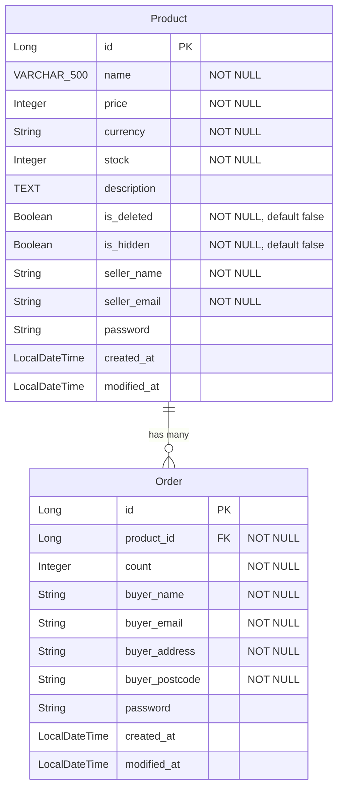

# Sparta Pre-Ecommerce

상품(Product)과 주문(Order) 두 도메인으로 구성된 주문 관리 서비스입니다.

## Tech Stack

- Java 21
- Spring Boot 4.0.2
- Spring Security (BCrypt 비밀번호 암호화)
- Spring Data JPA / Hibernate
- PostgreSQL
- SpringDoc OpenAPI 3.0.1 (Swagger UI)
- Lombok

## Getting Started

### 1. 데이터베이스 생성

```bash
createdb -U postgres ecommerce
```

### 2. 애플리케이션 실행

```bash
./gradlew bootRun
```

### 3. API 문서 확인

- Swagger UI: `http://localhost:8080/api/swagger-ui/index.html`
- OpenAPI JSON: `http://localhost:8080/api/v3/api-docs`

## ERD



## API Endpoints

### Product API

| Method | Endpoint | Description |
|--------|----------|-------------|
| GET | `/api/products` | 상품 목록 조회 (페이지네이션) |
| POST | `/api/products` | 상품 등록 |
| GET | `/api/products/{id}` | 상품 상세 조회 |
| PUT | `/api/products/{id}` | 상품 수정 (판매자 인증 필요) |
| DELETE | `/api/products/{id}` | 상품 삭제 (판매자 인증 필요) |
| GET | `/api/products/search` | 상품 검색 |

## Project Structure

```
com.sparta.ecommerce
├── _global
│   ├── component        # AnsiColorCode, GlobalValues
│   ├── config           # Security, WebMvc, Jackson, RestTemplate
│   ├── enums            # OrderStatus
│   ├── exception        # BusinessException, ExceptionCode, Handler
│   └── utility          # Timestamped, EncoderUtils, Utility
├── product
│   ├── controller       # ProductController
│   ├── dto              # ProductDto (Info, DetailInfo, Request, SellerAuth)
│   ├── entity           # Product
│   ├── repository       # ProductRepository
│   └── service          # ProductService, ProductServiceImpl
└── order
    └── entity           # Order
```

## Daily Log

### 2026-01-27
- 프로젝트 초기 세팅 (Spring Boot 4.0.2, PostgreSQL, Spring Security)
- Product 엔티티 및 CRUD API 구현 (등록, 조회, 수정, 삭제, 검색)
- Order 엔티티 설계 (Product와 ManyToOne 관계)
- 판매자 비밀번호 BCrypt 암호화 (EncoderUtils 유틸리티)
- 주문이 존재하는 상품의 가격 변경 방지 로직
- 글로벌 예외 처리 구조 구축 (BusinessException, ExceptionCode)
- Swagger (SpringDoc OpenAPI 3.0.1) 연동
- ERD 작성