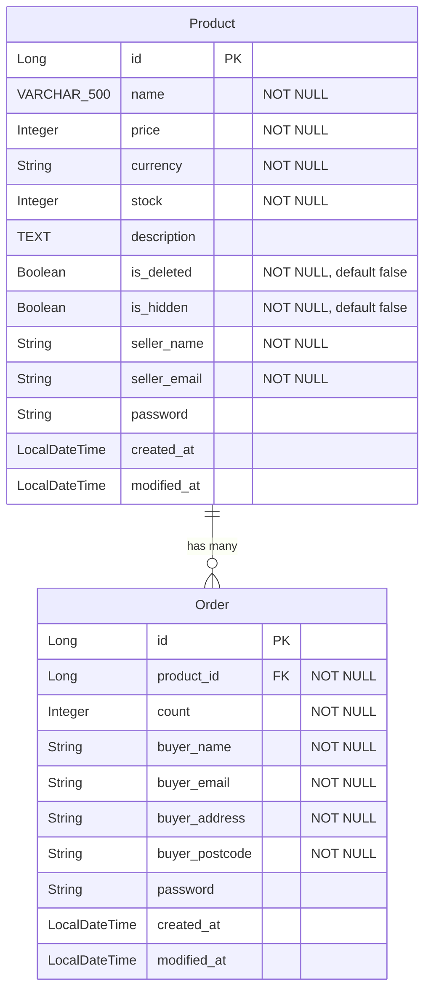

이번 과제는 상품(Product)과 주문(Order) 두 도메인으로 구성된 간단한 주문 관리 서비스 구현입니다.
과제는 필수 과제와 도전 과제로 나뉩니다. 아래 요구사항을 구현하세요.

## 필수 과제

### 1. 상품 CRUD
- 상품 등록 가능해야 합니다.
- 상품 단건 및 목록 조회 가능해야 합니다.
- 상품 수정 및 삭제 가능해야 합니다.
- 상품의 필드는 자유롭게 설계하세요 (예: `name`, `price` 등).

### 2. 주문 생성 및 조회
- 이미 등록된 상품의 ID로 주문을 생성할 수 있어야 합니다.
- 주문 시 상품은 한 개만 선택합니다.
- 주문 단건 조회가 가능해야 합니다.
- 주문 조회 시 주문한 상품의 `name`이 함께 노출되어야 합니다.
- 상품 이름을 수정하면, 이미 생성된 주문 조회 시에도 변경된 상품명이 반영되어야 합니다.
- 상품과 주문 간 연관관계를 적절히 설계하여 구현하세요.

## 도전 과제

### A. 주문 목록 조회
- 한 요청으로 여러 주문을 페이지네이션 조회할 수 있도록 구현하세요.
- 응답에 상품 `name`을 포함시켜야 합니다.
- 목록 조회 시 N+1 문제가 발생하지 않도록 구성하세요.
- 제출 시 실행 화면 캡처 1장 및 N+1 회피 방식을 한 줄로 설명해 주세요(로그 예시 포함 가능).

### B. 상품 재고 차감
- 상품 도메인에 `stock` 필드를 추가하세요.
- 주문 생성 시 주문 수량에 따라 `stock`을 감소시키세요.
- 재고가 0이면 주문 생성이 되지 않도록 처리하세요.
- 재고 차감이 원자적으로 처리되도록 방법을 고려하고 적용하세요(예: DB 락, 낙관적/비관적 락 등).
- 제출 시 재고 1인 상품에 대해 주문을 2번 시도한 결과 캡처 1장과 원자성 확보 방법의 선택 이유를 간단히 적어 제출하세요.

## ERD

